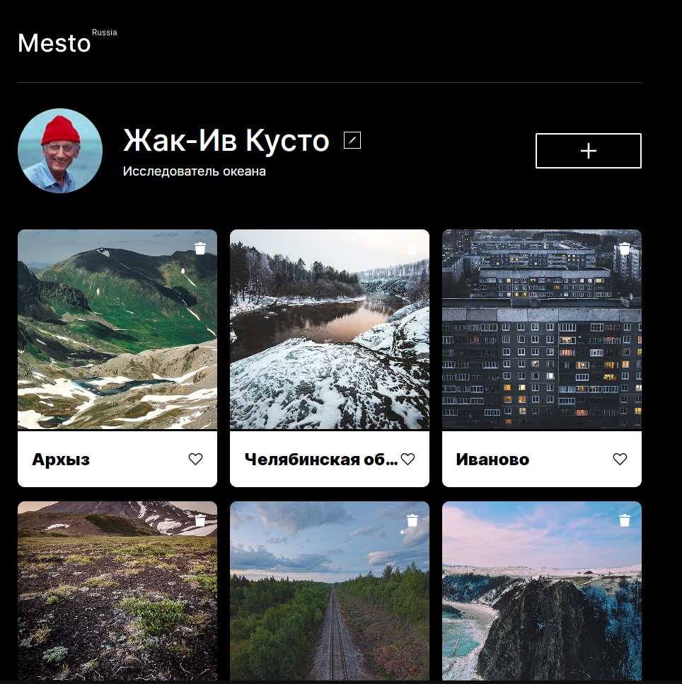

https://github.com/lev1996frontend/mesto-project-ff.git

# Яндекс Практикум, проектная работа  "Mesto"

## Оглавление

- [Ссылки](#ссылки)
- [Автор](#автор)
- [Макет](#макет)

## Краткое описание
Проектная работа Mesto включает в себя валидацию форм, интеграцию с API и деплой. Это интерактивная веб-страница, которая динамически добавляет карточки на основе JavaScript и стартеркита.

Функциональные возможности:
- При загрузке страницы пользователи могут увидеть шесть карточек, добавленных с помощью JavaScript, которые соответствуют заранее определённому макету.
- Проект акцентирует внимание на практическом применении шаблонов и обработчиков событий в JavaScript, что делает его отличным примером для изучения динамического веб-программирования.
- Добавлены интерактивные элементы, такие как:
  - Добавление фотографий из интернета.
  - Удаление только своих карточек.
  - Лайки для фотографий.
  - Удаление с возможностью отмены.
  - Валидация форм.
  - Подключение к серверу для обновления аватара пользователя.
  - Улучшенный UX всех форм.

Этот проект является полезным инструментом для обучения и практики в области веб-разработки.
Использованные технологии: Webpack.
### Как установить и запустить проект:

* Клонировать репозиторий:

```console
    git clone https://github.com/lev1996frontend/mesto-project-ff.git
```

* Установить зависимости:

```console
    npm install
```

* Собрать проект Вебпаком:

```console
    npm run build
```

* Запустить проект на локальном сервере:

```console
    npm run dev
```

### Скриншот




### Ссылки

- URL решения: [Github](https://github.com/lev1996frontend/mesto-project-ff.git)
- URL лайв сервера: [Github](https://lev1996frontend.github.io/mesto-project-ff/)

## Автор

- Github - [lev1996frontend](https://github.com/lev1996frontend)

### Макет

- Макет задания: [Figma](https://www.figma.com/design/bjyvbKKJN2naO0ucURl2Z0/JavaScript.-Sprint-5?node-id=0-1&t=Labg97fzhequOESg-0)
