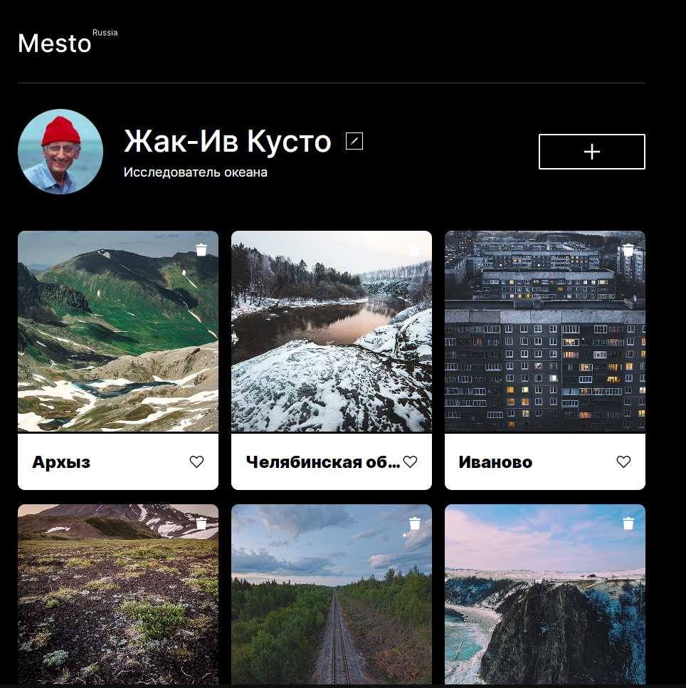

https://github.com/lev1996frontend/mesto-project-ff.git

# Яндекс Практикум, проектная работа "Mesto"
## Краткое описание
Этот проект представляет собой интерактивную веб-страницу, которая динамически добавляет карточки на основе JavaScript и стартеркита. При загрузке страницы, пользователи могут увидеть шесть карточек, добавленных с помощью JavaScript, которые соответствуют заранее определённому макету.
Проект выполнен с акцентом на практическое применение шаблонов и обработчиков событий в JavaScript, что делает его отличным примером для изучения динамического веб-программирования. 

## Оглавление

- [Яндекс Практикум, проектная работа "Mesto"](#яндекс-практикум-проектная-работа-mesto)
	- [Краткое описание](#краткое-описание)
	- [Оглавление](#оглавление)
		- [Скриншот](#скриншот)
		- [Ссылки](#ссылки)
	- [Автор](#автор)
		- [Макет](#макет)

### Скриншот

### Ссылки

- URL решения: [Github](https://github.com/lev1996frontend/mesto-project-ff.git)
- URL лайв сервера: [Github](https://lev1996frontend.github.io/mesto-project-ff/)

## Автор

- Github - [lev1996frontend](https://github.com/lev1996frontend)

### Макет

- Макет задания: [Figma](https://www.figma.com/design/bjyvbKKJN2naO0ucURl2Z0/JavaScript.-Sprint-5?node-id=0-1&t=Labg97fzhequOESg-0)
